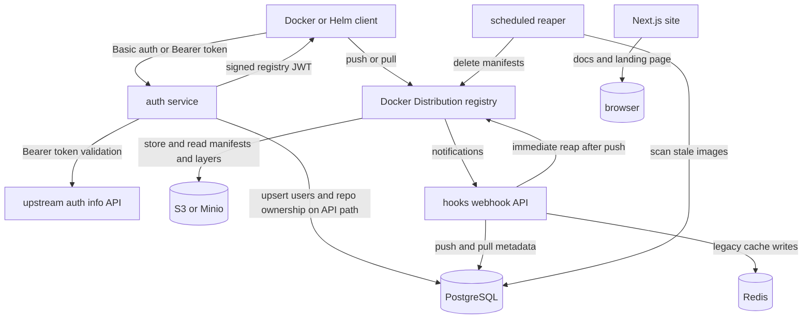

# AOCR Architecture

## System Summary

AOCR is an authenticated OCI registry built around Docker Distribution. It layers in:

- an auth service that validates user tokens and issues Docker-compatible bearer JWTs
- a webhook service that records push and pull metadata in Postgres
- a scheduled reaper that enforces tag retention policies
- S3-compatible blob storage for manifests and layers
- a small Next.js site for product and self-hosting documentation

The repository is a multi-service monorepo. The runtime behavior is mostly in `auth/`, `hooks/`, `registry/`, and `db/`. Deployment behavior lives in `helm/`, `docker-compose*.yaml`, and `ansible/`.

## Runtime Topology

## Runtime Components

| Component | Path | Responsibility | Primary Files |
| --- | --- | --- | --- |
| Auth service | `auth/` | Implements `/v2/token`, validates API tokens, static PATs, and cluster PATs, then signs JWTs the registry accepts. | `auth/src/server.ts`, `auth/src/clusterPat.ts`, `auth/src/metrics.ts` |
| Hooks API | `hooks/` | Accepts registry notifications, writes repository and image metadata, updates pull activity, and triggers immediate repo-scoped reaping on pushes. | `hooks/src/controllers/HookAPI.ts` |
| Reaper | `hooks/` | Runs on a cron schedule or once-on-demand, selects stale image rows, resolves digests, and deletes manifests from the registry. | `hooks/src/commands/reap.ts`, `hooks/src/util/imageRetention.ts` |
| Registry | `registry/` | Docker Distribution instance configured for token auth, webhook notifications, and S3-compatible storage. | `registry/config.yml`, `registry/entrypoint.sh`, `registry/garbage-collect.sh` |
| Metadata store | `db/` | Schema for users, repositories, and images plus follow-up migrations. | `db/init.sql`, `db/migrate-*.sql` |
| Web site | `web/` | Public-facing landing page and documentation UI. | `web/src/app/page.tsx`, `web/src/components/` |
| Helm chart | `helm/aocr/` | Kubernetes deployment packaging for the full stack. | `helm/aocr/values.yaml`, `helm/aocr/templates/` |
| Ansible wrapper | `ansible/` | Operator automation around Helm install and upgrade. | `ansible/playbooks/deploy-aocr.yml` |

## Main Flows

### 1. Login And Token Issuance

1. A client calls the auth service at `/v2/token`.
2. `auth/src/server.ts` extracts credentials from Basic auth or a Bearer token.
3. Validation order is:
   - static PAT match
   - cluster PAT match
   - upstream API validation via `VALIDATION_SERVICE_URL`
4. On the API validation path, the auth service upserts the user in Postgres and optionally associates repository ownership based on the requested scope.
5. The auth service signs an RS256 JWT with the configured private key and returns a Docker-compatible token payload.

Important files:

- `auth/src/server.ts`: request parsing, validation order, Postgres sync, JWT issuance
- `auth/src/clusterPat.ts`: cluster PAT parsing and scope restriction rules
- `auth/src/metrics.ts`: latency and outcome metrics

### 2. Push Flow

1. A client pushes an image to the registry.
2. The registry stores manifests and blobs in S3-compatible storage.
3. The registry emits a webhook event to `hooks` using the shared hook token.
4. `hooks/src/controllers/HookAPI.ts` processes push events:
   - parses repository provenance
   - parses tag retention suffixes
   - caches the pushed image in Redis
   - upserts repository and image metadata in Postgres
5. The hooks service immediately calls the reaper logic for the affected repository.

Important files:

- `registry/config.yml`: webhook endpoint and auth token header
- `hooks/src/controllers/HookAPI.ts`: event ingestion and metadata sync
- `hooks/src/util/tagRetention.ts`: `--ttl-*`, `--idle-*`, and provenance parsing
- `hooks/src/util/imageRetention.ts`: actual stale selection and registry deletes

### 3. Pull Flow And Idle TTL Refresh

1. A client pulls an image from the registry.
2. The registry emits a pull event.
3. `HookAPI.ts` updates `last_pulled_at` for matching idle-retention rows.
4. The scheduled reaper later uses `last_pulled_at` plus `retention_value_seconds` to decide whether idle tags have expired.

### 4. Scheduled Reaping

1. The `reap` command in `hooks/src/commands/reap.ts` starts a cron job or runs once when `REAPER_RUN_ONCE=true`.
2. `hooks/src/util/imageRetention.ts` queries Postgres for four stale groups:
   - plain tags beyond the newest `keep-latest` image in each repository
   - TTL tags past `expires_at`
   - idle tags past `last_pulled_at + retention_value_seconds`
   - mirror images that exceed the configured mirror idle retention
3. For each stale row, the reaper resolves the manifest digest if needed, calls the registry `DELETE /v2/<repo>/manifests/<digest>` API, then removes the row from Postgres and Redis cache entries.

## Data Model

The database bootstrap is in `db/init.sql`.

| Table | Purpose | Key Fields |
| --- | --- | --- |
| `users` | Authenticated user records synced from the upstream validator. | `external_id`, `username`, `email`, `auth_provider`, `profile` |
| `repositories` | Namespace and repository records. | `organization`, `name`, `user_id` |
| `images` | Per-tag metadata and retention state. | `repository_id`, `tag`, `last_pushed_at`, `last_pulled_at`, `retention_mode`, `retention_value_seconds`, `expires_at`, `manifest_digest`, `provenance`, `cluster_id`, `upstream_ref` |

Important retention-related columns live on `images`:

- `retention_mode`: `keep-latest`, `ttl`, or `idle`
- `retention_value_seconds`: parsed TTL or idle duration
- `expires_at`: absolute TTL expiry for `ttl` tags
- `last_pulled_at`: idle refresh signal
- `manifest_digest`: cached digest used for registry deletion
- `provenance`: `pushed`, `mirror`, or `cluster-snapshot`

## Directory Guide

### Product And Operator Docs

- `README.md`: product overview and hosted usage
- `SELF_HOSTING.md`: self-hosting walkthrough
- `RETENTION.md`: retention contract and GC caveat
- `OBSERVABILITY.md`: metrics matrix and dashboards
- `understanding.md`: short lifecycle narrative
- `aocr_architecture_blog.md`: longer narrative writeup

### Service Source Trees

- `auth/src/`
  - `server.ts`: all auth control flow and the only token endpoint
  - `clusterPat.ts`: cluster PAT token parsing and scope decisions
  - `metrics.ts`: Prometheus metrics
  - `__tests__/clusterPat.test.ts`: direct cluster PAT tests
- `hooks/src/`
  - `controllers/HookAPI.ts`: registry event ingestion
  - `commands/hooks.ts`: API process entry
  - `commands/reap.ts`: reaper process entry
  - `util/tagRetention.ts`: retention suffix and provenance parsing
  - `util/imageRetention.ts`: stale selection and registry deletion
  - `metrics.ts`: Prometheus metrics
  - `server/server.ts`: ts-express-decorators server boot
- `web/src/`
  - `app/`: app shell and root page
  - `components/`: mostly section-based UI for the landing page
  - `lib/utils.ts`: shared web utility helpers

### Deployment And Packaging

- `docker-compose.yaml`: local full stack
- `docker-compose.metrics.yaml`: exposes registry metrics port locally
- `docker-compose.gc.yaml`: runs registry garbage collection locally
- `helm/aocr/values.yaml`: main chart configuration surface
- `helm/aocr/templates/`: per-service manifests plus metrics and GC resources
- `helm/aocr/files/init.sql`: chart-local copy of the bootstrap schema
- `ansible/`: deployment automation on top of Helm
- `.github/workflows/deploy.yml`: image and chart publishing to GHCR

### Supporting Material

- `deploy/grafana/`: bundled Grafana dashboard
- `plans/`: future work and design docs, especially cluster mirror and snapshot behavior
- `static/`: static assets consumed by the web app
- `secrets/`: local ignored secrets for development and ops

## Change Routing

| If you need to change... | Start Here | Then Check |
| --- | --- | --- |
| Docker login failures or wrong JWT scopes | `auth/src/server.ts` | `SELF_HOSTING.md`, `registry/config.yml` |
| Cluster namespace permissions | `auth/src/clusterPat.ts` | `auth/src/server.ts` |
| Why a tag was kept or deleted | `hooks/src/util/tagRetention.ts` | `hooks/src/util/imageRetention.ts`, `RETENTION.md` |
| Webhook event handling | `hooks/src/controllers/HookAPI.ts` | `registry/config.yml` |
| Metrics names or scrape wiring | `auth/src/metrics.ts`, `hooks/src/metrics.ts` | `OBSERVABILITY.md`, Helm metrics templates |
| Database schema | `db/init.sql` | `db/migrate-*.sql`, `helm/aocr/files/init.sql` |
| Kubernetes deployment | `helm/aocr/values.yaml` | `helm/aocr/templates/`, `SELF_HOSTING.md` |
| VM-backed deployment automation | `ansible/playbooks/deploy-aocr.yml` | `ansible/README.md` |
| Public site layout or copy | `web/src/app/page.tsx` | `web/src/components/` |

## Build, Test, And Validation Surfaces

- Auth
  - install and test: `cd auth && corepack enable && pnpm install --frozen-lockfile && pnpm test`
- Hooks
  - typecheck and test: `cd hooks && npm install && npx tsc -p tsconfig.json && npm test`
- Web
  - lint and build: `cd web && npm install && npm run lint && npm run build`
- Helm
  - chart lint: `helm lint helm/aocr`
- Ansible
  - syntax check: `cd ansible && ansible-playbook playbooks/deploy-aocr.yml --syntax-check`

## Practical Gotchas

- `hooks/` contains both API and reaper logic. Do not assume `hooks/src/server.ts` is the HTTP server; it is the CLI entrypoint.
- `auth/dist-test/`, `hooks/build/`, and `hooks/build-test/` are generated artifacts. Prefer editing `src/` and `test/`.
- `db/init.sql` and `helm/aocr/files/init.sql` both matter for schema changes.
- The web app is mostly marketing and documentation. It does not own registry behavior.
- `registry/config.yml` is an environment-substituted template, so deployment values can change behavior without editing TypeScript.
- `plans/cluster-mirror-and-snapshot-distribution.md` describes future-facing behavior. Some groundwork already exists in code through `provenance`, `cluster_id`, `upstream_ref`, and cluster PAT scope checks.