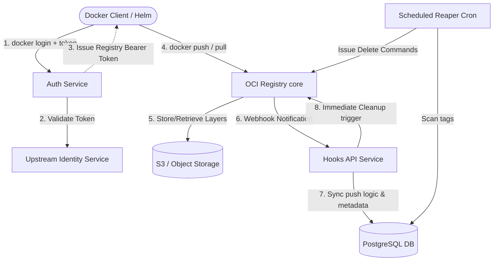

# Building aocr: A Self-Cleaning, Authenticated Open-Source OCI Registry

Managing container images at scale is deceptively difficult. From spiraling storage costs to wrangling custom authentication integrations, maintaining a private container registry often requires heavy operational overhead. Today, I'm sharing the architecture behind **aocr**, an open-source authenticated OCI registry built to resolve these exact pains. 

Here is a deep dive into why we built it, how its architecture automatically handles lifecycle management, the impact it has driven, and how you can self-host it for your own infrastructure.

---

## 🛑 The Problem Statement

When operating container infrastructure, teams generally face two main challenges with standard generic registries:

1. **Unbounded Storage Growth**: Registries naturally inflate over time as CI/CD pipelines endlessly push new commits and tags. Without an aggressive cleanup policy, you end up storing terabytes of stale, unused image layers in your backend storage, dramatically increasing costs.
2. **Authentication Silos**: Standard registries either utilize basic `.htpasswd` files or require complex OIDC setups. Startups and enterprise internal developer platforms often want to validate push/pull requests against their own upstream core application profiles via PATs (Personal Access Tokens), which isn't straightforward out of the box.

We needed a registry that deeply understood repository-level retention policies by default and fluidly integrated with a proprietary application auth validation endpoint.

### Why not use GitHub, Docker, AWS, Azure, or GCP registries?

While hosted registries from major cloud providers are fantastic for standard use cases, they introduce specific friction when building a seamless Internal Developer Platform (IDP):

- **Authentication Fragmentation**: GitHub, AWS, and GCP registries require generating separate service accounts, managing IAM roles, or configuring OIDC federations. It's nearly impossible to allow developers to simply use the exact same Personal Access Token (PAT) they already use for your application to directly run `docker login`.
- **The Cost of Stale Layers**: Cloud providers typically charge per GB of storage. While lifecycle management policies do exist in most platforms, they are often complex to configure correctly-especially when dealing with hundreds of dynamically spun-up ephemeral repositories. `aocr` solves this by aggressively deleting stale layers *by default*.
- **Vendor Lock-in**: Tying your registry access deeply to AWS IAM or GCP Service Accounts forces your entire CI/CD pipeline to depend on that provider's identity structure. By abstracting the storage layer to any S3-compatible backend (even self-hosted Minio), `aocr` remains fully portable and cloud-agnostic.

---

## 💡 The Solution: aocr Architecture

**aocr** is built around an open-source OCI registry core (Docker Distribution v2). It intelligently adds layers for metadata tracking via PostgreSQL, smart cleanup via a Node.js-based Reaper, and token validation via a dedicated Auth service. Image layers and manifests themselves safely reside in S3-compatible storage.

### The Architecture Diagram

Here is a look at the system topology when a `docker push` occurs:



### The Life of a Push

1. **Upload & Auth**: The developer triggers a `docker push`. They provide their application's PAT, which our local `Auth Service` securely validates against an upstream `/api/auth/info` endpoint. A JWT registry token is seamlessly issued to the Docker client to authorize the push.
2. **Storage**: The OCI Registry accepts the image and dumps the layers and manifests into standard S3 storage.
3. **Event Notification**: The Registry then natively fires a webhook event to our `Hooks API` to announce the successful push.
4. **Metadata Tracking**: The Hook records the specific repository name and image tags in our PostgreSQL database, establishing a strong source of truth for `last_pushed_at`.
5. **Continuous Cleanup**: The `Hooks API` immediately drops older tags specifically for that repository name, keeping only the most up-to-date image. Concurrently, a scheduled `Reaper` scans PostgreSQL asynchronously to guarantee that across *every* repository, old manifest garbage is consistently deleted. 

---

## 🚀 The Impact 

By migrating to this architecture, the benefits were immediate:

- **Dramatically Lowered Cloud Bills**: Because the repository-aware cleanup aggressively culls out-of-date image manifestations, S3 buckets remain entirely constrained to *active* artifacts. The storage curve flattened out completely.
- **Unified Identity**: Developers use the exact same Personal Access Token they use on the main platform to authorize Docker sessions. No secondary credentials to rotate, no hidden `.htpasswd` files.
- **Database-Backed Clarity**: S3 object storage lacks queryable context. By projecting push events into PostgreSQL, queries across repositories, users, and organization limits become trivial `SELECT` statements rather than expensive object-store scans.

---

## 🛠 How to Self-Host `aocr`

Because **aocr** is fully open-source, you can deploy the complete stack onto your own Kubernetes cluster using the provided Helm chart. 

### Prerequisites
- Kubernetes cluster
- PostgreSQL and Redis (can be run in-cluster)
- S3-compatible object storage (AWS S3, Minio, etc.)
- A custom Auth validation endpoint returning identity JSON.

### Helm Deployment

Deploying the stack relies on injecting your custom S3 credentials and telling the Auth service where your upstream validation endpoint resides:

```bash
helm install aocr oci://ghcr.io/aerol-ai/charts/aocr \
  --namespace aocr-system \
  --create-namespace \
  --version <published-chart-version> \
  --set global.domain="registry.yourdomain.com" \
  --set registry.s3.region="us-east-1" \
  --set registry.s3.bucket="my-aocr-bucket" \
  --set registry.s3.accessKey="S3_ACCESS_KEY" \
  --set registry.s3.secretKey="S3_SECRET_KEY" \
  --set auth.validationServiceUrl="https://app.yourdomain.com/api/auth/info" \
  --set-file auth.jwtPrivateKey="/path/to/jwt-private.pem" \
  --set-file auth.jwtPublicCertificate="/path/to/jwt-public.crt"
```

Once deployed, your developers can log in instantly via standard Docker toolchains:

```bash
export AOCR_LOGIN="developer@company.com"
export AOCR_TOKEN="upstream-app-pat-token"

echo "$AOCR_TOKEN" | docker login registry.yourdomain.com -u "$AOCR_LOGIN" --password-stdin

docker tag my-service registry.yourdomain.com/my-org/my-service:main
docker push registry.yourdomain.com/my-org/my-service:main
```

### Get Involved
By removing the complexity of identity integrations and solving standard registry bloat natively, **aocr** allows your platform engineers to stop configuring registries and to start focusing on delivery. 

You can check out the source code, open issues, and read the deeper architectural documentation over on our GitHub repository. Keep shipping! 🚀
